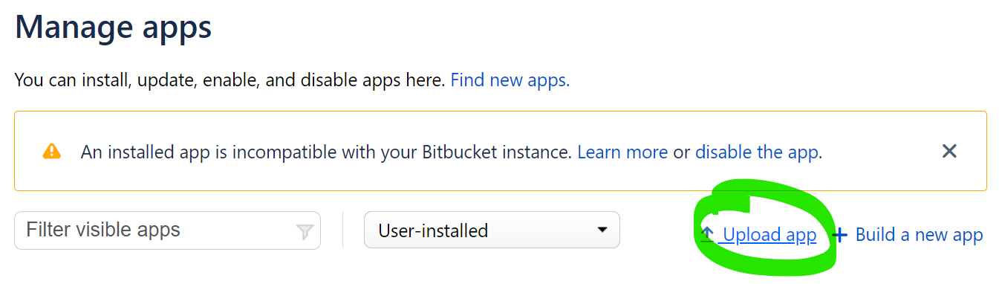
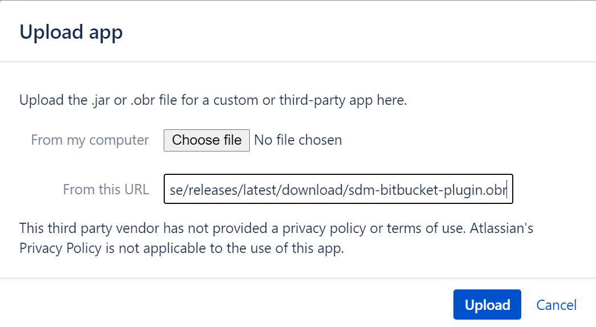

= CloudBees SDM Bitbucket Plugin

This repository contains the stable versions of the CloudBees SDM Bitbucket Server Plugin which can be installed on a Bitbucket Server instance to allow data to be collected by Cloudbees Software Delivery Management.
For more information on the CloudBees Bitbucket Server integration, please visit the link:http://cloudbees.com/r/cloudbees-sdm-integrations-bitbucket[official CloudBees documentation].

== Instructions

. Navigate to the manage apps section of your Bitbucket Server instance by selecting the cog-wheel in the top-right and selecting `Manage apps`

. Select the link on the right to *Upload app*
+
.Link for "Upload app"
[#img-sunset]
[caption=""]

. Enter the following URL into the "From this URL" textbox and click *Upload*
+
`https://github.com/cloudbees/sdm-bitbucket-plugin-release/releases/latest/download/sdm-bitbucket-plugin.obr`
+
.Link for "Upload app"
[#img-sunset]
[caption=""]

[NOTE]
====
This link will pull the latest version of the CloudBees SDM Bitbucket Plugin. To choose a specific version, download it from link:https://github.com/cloudbees/sdm-bitbucket-plugin-release/releases[Releases].
====

. The latest version of the plugin will be fetched and installed onto your Bitbucket instance.For more information on how to associate this server with your CloudBees Software Delivery Management account, please see visit the link:http://cloudbees.com/r/cloudbees-sdm-integrations-bitbucket[official CloudBees documentation].
